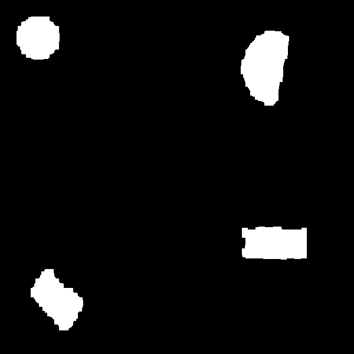
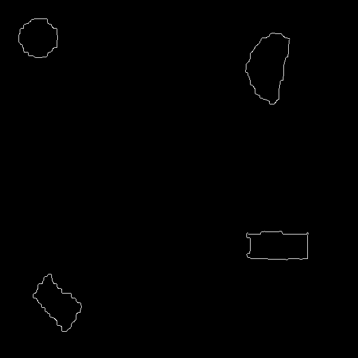

# OpenCV - object classification

The repository includes a project for classifying objects in images using simple image processing operations. 
The repository contains a database of 100 images in the shapes directory, a module with functions and main file.

## Table of contents
* [General](#general)
* [Steps](#steps)
* [Results](#results)

## General
Image database contains 100 images divided into two object classes - rectangles and circles. 
Each image has random noise, intensity and hue change implemented and there are some distortions in the random images. 
The aim of the project is to propose an effective method to determine the class of objects in images.

## Steps 
The proposed method uses a series of operations. The operations will be shown with the example of four images.
1. Converting a color image to a grey-scale image;

2. Image binarization using an automatic threshold selection method (https://docs.opencv.org/4.x/d7/d4d/tutorial_py_thresholding.html);

3. Improving object representation with morphological operations - 
images were subjected to closing operation, opening operation, erosion operation and dilation operation (https://docs.opencv.org/3.4/d9/d61/tutorial_py_morphological_ops.html);

 &nbsp;&nbsp; 

 &nbsp;&nbsp; 

4. Determining the edges of objects (https://docs.opencv.org/4.x/da/d22/tutorial_py_canny.html);

5. Determining selected shape coefficients of objects and making classification based on them (https://docs.opencv.org/4.x/dd/d49/tutorial_py_contour_features.html). 
The images were classified based on the following coefficients of shapes: 
-  (maximum distance between centroid and object contour)/(minimum distance between centroid and object contour) 
-  (maximum distance between centroid and object contour)/( mean distance between centroid and object contour) 
-  (minimum distance between centroid and object contour)/( mean distance between centroid and object contour) 

## Results

The efficiency of the classification procedure is 94% (6 images out of 100 were misclassified).The accuracy of the classification was based on the names of the images - images showing a circle have "circ" in the name, and images showing rectangles have "rect" in the name.
